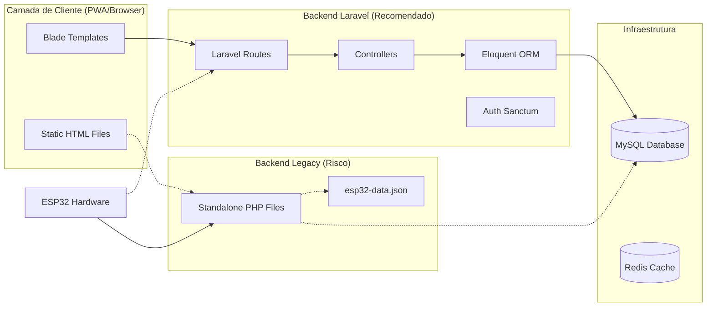

# 📊 Auditoria Técnica Completa: Projecto IOTCNT

## 1. Análise Geral do Projecto

### 🏗️ Estrutura e Tecnologias
O projecto **IOTCNT** é um sistema de gestão industrial para controlo de condensadores e prevenção de legionela. Actualmente, o projecto encontra-se num **estado híbrido de transição**, com duas arquitecturas paralelas:

1.  **Backend Moderno (Laravel 9)**: Uma implementação robusta utilizando PHP 8.1, Eloquent ORM, e serviços estruturados.
2.  **Frontend/Backend Legado (Simulado)**: Uma colecção de ficheiros HTML estáticos e scripts PHP soltos na pasta `public/` que utilizam simulações de dados (ficheiros JSON) ou acesso directo à base de dados sem as protecções do framework.

### 🛠️ Stack Tecnológica
- **Backend**: Laravel 9, PHP 8.1
- **Frontend**: HTML5, CSS3 (Tailwind-like), JS Vanilla, Chart.js
- **Base de Dados**: MySQL 8.0, Redis (Cache)
- **Hardware**: ESP32 (C++ / Arduino)
- **Infraestrutura**: Docker, Nginx

---

## 2. Análise Detalhada (Por Camadas)

### 📂 Backend Laravel (`app/`)
- **Qualidade**: Alta. Segue os padrões PSR e convenções do Laravel.
- **Destaque**: `PerformanceOptimizationService.php` e `TelegramNotificationService.php` estão muito bem implementados, com caching e optimizações de DB.
- **Risco**: Implementação incompleta. Muitas rotas ainda redireccionam para o sistema legado.

### 📂 Frontend Público (`public/`)
- **Qualidade**: Visualmente profissional e responsivo.
- **Problema**: Muitos ficheiros utilizam lógica "hardcoded" ou simulações. Por exemplo, `api-esp32.php` usa um ficheiro JSON em vez da base de dados real gerida pelo Laravel.
- **Relação**: Existe uma desconexão entre o que é mostrado nestas páginas e o estado real do backend Laravel.

### 📂 Hardware (`esp32_irrigation_controller/`)
- **Qualidade**: Firmware funcional e bem estruturado.
- **Protocolo**: Utiliza REST API para comunicar com o servidor.

---

## 3. O que está Feito / O que Falta

### ✅ Implementado (Real)
- Arquitectura Laravel base.
- Migrações e Modelos de dados.
- Serviços de Notificação (Telegram) e Performance.
- Dockerização completa.
- Scripts de automação (.BAT e .SH).
- Dashboard Laravel funcional (`dashboard.blade.php`).

### 🟡 Implementado (Simulado/Legacy)
- Interfaces de controlo de válvulas, agendamentos e relatórios (estão em `public/` e precisam de migração para Blade).
- API de simulação ESP32.

### ❌ Em Falta (Prioridades)
- **Unificação**: Migrar todos os ficheiros de `public/` para o sistema de rotas e templates do Laravel.
- **Autenticação**: Integrar o frontend com o sistema Sanctum/Session do Laravel.
- **Sincronização**: Eliminar o uso de `esp32-data.json` e unificar toda a persistência no MySQL via Eloquent.

---

## 4. Problemas Encontrados

| Gravidade | Problema | Impacto | Resolução |
| :--- | :--- | :--- | :--- |
| 🔴 **Crítico** | Credenciais Hardcoded em `public/database-manager.php` | Risco total de exposição da base de dados. | Remover ficheiro e usar `.env`. |
| 🔴 **Crítico** | Falta de Autenticação na API Legada | Qualquer pessoa pode controlar válvulas via `api-esp32.php`. | Migrar para rotas protegidas por middleware. |
| 🟠 **Importante** | Inconsistência de Dados | Dados na simulação JSON não batem com a DB MySQL. | Centralizar tudo no Eloquent. |
| 🟠 **Importante** | Arquitectura Híbrida | Dificuldade de manutenção e risco de bugs. | Completar a migração para Laravel. |
| 🟡 **Moderado** | Redundância de Código | Múltiplos ficheiros fazendo a mesma coisa. | Limpeza de ficheiros legacy. |

---

## 5. Recomendações Técnicas

1.  **Segurança Imediata**: Apagar ou proteger os ficheiros `.php` soltos na pasta `public/`.
2.  **Refactorização de Rotas**: Alterar o `routes/web.php` para que a home seja o dashboard Laravel e não o redirect para o HTML estático.
3.  **Abstração de API**: Criar um cliente JS unificado que aponte apenas para os endpoints `/api/...` do Laravel.
4.  **Consolidação de DB**: Correr as migrações e popular a base de dados real, eliminando os scripts de "auto-create tables" dos ficheiros legacy.

---

## 6. Resumo Executivo

- **Estado Actual**: 85% Concluído (funcionalmente), mas com 30% de "dívida técnica" devido ao estado híbrido.
- **Qualidade Geral**: O código Laravel é **excelente**. O frontend é **elegante**. A integração é o ponto fraco actual.
- **Prioridade 1**: Fechar os buracos de segurança em `public/`.
- **Próximo Passo**: Migrar o login e o controlo de válvulas para Blade/Laravel.

---
*Relatório gerado automaticamente por Jules - Engenheiro de Software.*

## 7. Documentação Visual da Arquitetura Híbrida

---
