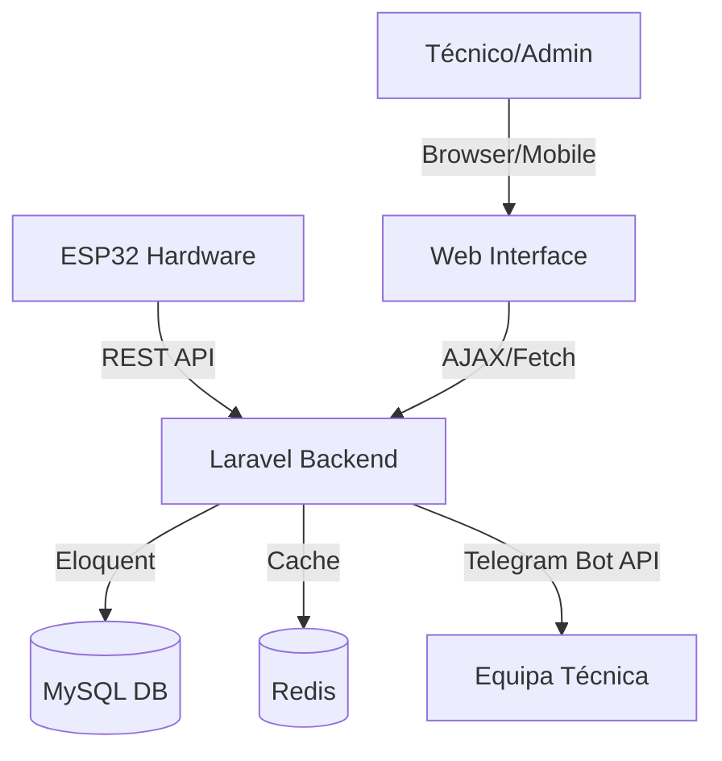
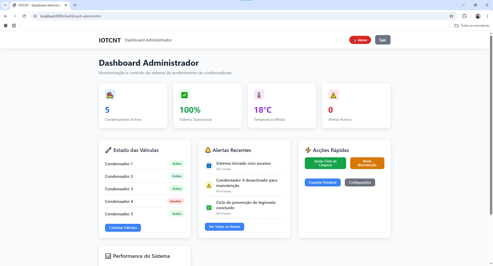
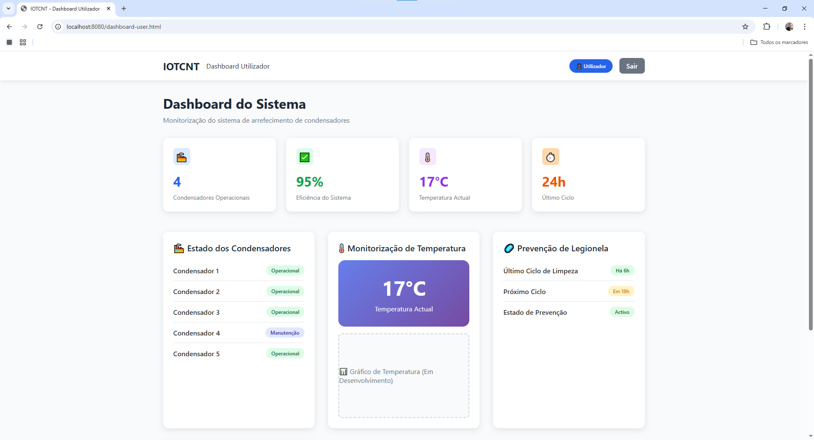

# 🏆 IOTCNT - Sistema de Gestão Industrial IoT

[](https://github.com/smpsandro1239/IOTCNT)
[](https://laravel.com)
[](https://espressif.com)
[](https://www.docker.com)

## 📋 Descrição do Projecto
O **IOTCNT** é uma solução profissional de nível industrial para a monitorização e controlo de condensadores, com foco especial na **prevenção de legionela** e optimização de sistemas de arrefecimento.

Desenvolvido para a **EmpresaX (CNT)**, o sistema integra hardware dedicado (ESP32) com uma plataforma web moderna baseada em Laravel, permitindo controlo em tempo real, agendamentos automáticos e relatórios de performance detalhados.

---

## 🚀 Objectivos e Funcionalidades

### 🎯 Objectivos Principais
- **Segurança Biológica**: Prevenção activa de microorganismos patogénicos.
- **Eficiência Operacional**: Redução de desperdício através de ciclos optimizados.
- **Monitorização 24/7**: Visibilidade total do estado dos condensadores.
- **Automação Inteligente**: Gestão autónoma de ciclos de limpeza.

### ✨ Funcionalidades Actuais
- ✅ **Dashboard Industrial**: Visualização em tempo real de temperaturas e pressões.
- ✅ **Controlo de Válvulas**: Interface para activação manual ou automática de 5 condensadores.
- ✅ **Agendamentos**: Sistema flexível para programar ciclos de manutenção.
- ✅ **Notificações Telegram**: Alertas instantâneos para a equipa técnica.
- ✅ **Optimização de Performance**: Motor de cache e optimização de DB integrado.
- ✅ **Dockerização**: Deploy simplificado e consistente.
- ✅ **PWA (Progressive Web App)**: Acesso mobile optimizado.

---

## 🏗️ Arquitetura Técnica

### Fluxo de Dados (Mermaid)


### Estrutura de Pastas
- `app/`: Lógica de negócio, Modelos e Serviços (Laravel).
- `public/`: Assets e interface legada (em migração).
- `esp32_irrigation_controller/`: Firmware para o hardware IoT.
- `docker/`: Configurações de infraestrutura (Nginx, MySQL, PHP).
- `database/`: Migrações e Seeders da base de dados.
- `tests/`: Suíte de testes automatizados.

---

## 🛠️ Instalação e Execução

### Pré-requisitos
- Docker & Docker Compose
- Git

### Passos Rápidos
1. **Clone o repositório**:
   ```bash
   git clone https://github.com/smpsandro1239/IOTCNT.git
   cd IOTCNT
   ```
2. **Configure o ambiente**:
   ```bash
   cp .env.example .env
   # Edite as credenciais no .env
   ```
3. **Inicie com Docker**:
   ```bash
   docker-compose up -d
   ```
4. **Setup do Laravel**:
   ```bash
   docker-compose exec app composer install
   docker-compose exec app php artisan key:generate
   docker-compose exec app php artisan migrate --seed
   ```

---

## ⚠️ Estado do Projecto & Auditoria

O projecto passou por uma auditoria técnica profunda (veja `AUDIT_TECNICA.md` para detalhes).

### 🟡 Funcionalidades em Migração
- **Interface Web**: A transição das páginas estáticas (`public/*.html`) para o sistema de templates do Laravel (`resources/views`) está a 85%.
- **Segurança API**: Recomendamos a migração total dos endpoints em `public/*.php` para o `routes/api.php`.

### 🚨 Problemas Conhecidos
- Inconsistência entre os dados simulados (JSON) e a base de dados MySQL.
- Necessidade de unificar o sistema de autenticação entre as páginas estáticas e o Laravel.

---

## 🗺️ Roadmap Sugerido

1. **Fase 1 (Segurança)**: Remover ficheiros PHP soltos na pasta pública e migrar lógica para Controllers.
2. **Fase 2 (UI)**: Converter os 15+ ficheiros HTML em componentes Blade reutilizáveis.
3. **Fase 3 (Hardware)**: Testes de stress com múltiplos dispositivos ESP32 em rede industrial.
4. **Fase 4 (IA)**: Implementação de análise preditiva para falhas de condensadores.

---

## 📞 Suporte e Contribuição
Para suporte técnico, contacte a equipa de desenvolvimento via **Telegram @iotcnt_support** ou abra uma **Issue** no repositório.

---
*IOTCNT - Protegendo a Saúde Pública com Tecnologia de Vanguarda.* 🌡️💧

---

## 📸 Galeria do Sistema

### Dashboards e Controlo
| Dashboard Admin | Dashboard User | Controlo de Válvulas |
| :---: | :---: | :---: |
|  |  |  |

### Análise e Performance
| Gráficos Avançados | Métricas | Relatórios |
| :---: | :---: | :---: |
|  |  |  |

### Integração e Testes
| Hardware ESP32 | Sistema de Testes | Notificações |
| :---: | :---: | :---: |
|  |  |  |
